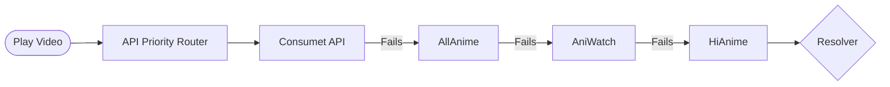

# 📺 ToonPlayer - Premium Anime Streaming App

### 🔴 **Live Demo:** (https://www.toonplayer.in/)

ToonPlayer is a modern, ad-free anime streaming application (the ultimate **AnimeWatch** alternative) built with **Next.js 15** and **React 19**. It features a sleek, responsive UI, real-time search, and a robust video player that aggregates sources from multiple providers.


## 📸 Screenshots

| Popular Grid | Search Suggestions |
|:---:|:---:|
|  |  |

| Filter Results | Watch Page |
|:---:|:---:|
|  |  |

### 🎬 Featured Sections (Hero Carousels)

| Trending Movies | Popular TV Shows |
|:---:|:---:|
|  |  |

| Trending TV Shows | Movies Grid |
|:---:|:---:|
|  |  |

## ✨ Key Features

- **🔄 Real-time Updates**: Automatically pulls live popular, top, and recent lists directly from the fastest providers without stale caching.
- **🎬 Smart Video Player**: Auto-selects the best streaming source and bypasses CORS restrictions using a smart proxy.
- **📺 TV Show Seasons**: Deep integration with TMDB API to natively fetch TV Show seasons, metadata, and episode thumbnails within a dynamic interactive grid.
- **🔗 Hybrid Fallback Network**: Utilizes the open-source **Consumet API** as the primary source resolver, seamlessly falling back to direct provider queries (AllAnime, AniWatch, HiAnime) if streams are encrypted or missing.
- **🚀 High Performance**: Built on Next.js 15 for server-side rendering and lightning-fast page loads.
- **📱 Responsive Contextual UI**: Intelligent mobile modals that contextually switch between Anime and Movie search engines based on active routes, with a full-bleed OLED Dark Mode desktop layout.
- **🌙 Modern Design**: Premium dark mode aesthetic with glassmorphism, contextual coloring, and smooth animations using Framer Motion.
- **⚡ Android Native**: Built-in support for Android via **Capacitor**, featuring native back-button handling and high-performance WebView.

## 🛠️ Development Process & Automation

ToonPlayer is designed to be a "Zero Maintenance" app. Here is how it updates automatically and handles data:

### 1. 🔄 Real-time Data Syncing
Instead of relying on static site generation (SSG) which gets stale, ToonPlayer uses **Real-time API Fetching**:
- **Zero Cache Strategy**: Every request to the `popular`, `recent`, or `trending` APIs bypasses all server-side caches.
- **Scraper Pipeline**: We built custom scrapers for **Anikai** and **AllAnime** that parse the latest HTML content directly when a user visits.
- **Auto-Refresh**: The Home page includes a client-side timer that refreshes the data every **60 seconds**, ensuring users never miss a new episode release.

### 2. 🚀 The Cascading Fallback Network
To guarantee 99.9% uptime for streams (despite anti-bot protections and AES encryption), ToonPlayer uses a **Dynamic Priority Fallback Pipeline**:

```mermaid
graph LR
    User([Play Video]) --> Route[API Priority Router]
    Route --> C[Consumet API]
    C -- Fails --> A[AllAnime]
    A -- Fails --> AW[AniWatch]
    AW -- Fails --> H[HiAnime]
    H --> Stream{Resolver}
```
If the primary AniList ID fails to map properly, the backend automatically drops down the chain, parsing raw HTML to extract highly protected `.m3u8` streams natively.

### 3. 📺 TMDB TV Show Integration
For non-anime content, the `/api/prime` suite communicates with TheMovieDatabase (TMDB). It pulls complete seasonal metadata and episode arrays, injecting them into a frontend Interactive Glassmorphic Grid so users can flawlessly select any episode across any season.

### 3. Build & Deployment
- **Web**: Automatically deployed to **Vercel** on every push to `main`.
- **Mobile**: Compiled to **Android APK** using Gradle and Capacitor. We increment versioning (currently **v1.6**) for every major UI or performance overhaul.

## 🛠️ Tech Stack

### Frontend
- **Framework**: [Next.js 15](https://nextjs.org/) (App Router)
- **Library**: [React 19](https://react.dev/)
- **Styling**: [Tailwind CSS v4](https://tailwindcss.com/)
- **Animations**: [Framer Motion](https://www.framer.com/motion/)
- **Video Player**: [ArtPlayer](https://artplayer.org/) with HLS.js
- **Icons**: [Lucide React](https://lucide.dev/)
- **HTTP Client**: [Axios](https://axios-http.com/)
- **Notifications**: [React Hot Toast](https://react-hot-toast.com/)

### Backend & Data Sources
- **Meta Integrations**: [TMDB API](https://developer.themoviedb.org/) (Movies/TV), [AniList GraphQL](https://anilist.co/api/v2/oauth/docs) (Anime Autocomplete)
- **Primary Source Resolver**: [Consumet API Wrapper](https://docs.consumet.org/)
- **Fallback Providers**:
  - **AllAnime** ([allanime.day](https://allanime.to))
  - **AniWatch/Zoro**
  - **HiAnime**
  - **Anikai**
- **Video Servers**: Aggregated stream extraction via `ToonPlayer-VIP`, `VidLink`, and `AutoEmbed`.

### Deployment
- **Hosting**: [Vercel](https://vercel.com/)
- **CI/CD**: Automatic deployment on push to `main` branch

## 🎨 Design Inspiration

ToonPlayer's UI/UX draws inspiration from leading streaming platforms:

- **[Zoro.to](https://zoro.to)**: Server toggle system, minimal dark theme, episode grid layout
- **[Netflix](https://netflix.com)**: Featured hero section, hover animations on cards
- **[Crunchyroll](https://crunchyroll.com)**: Anime-focused color palette (purple/cyan accents)
- **[Spotify](https://spotify.com)**: Glassmorphism effects on modals and overlays

**Color Palette:**
- Primary: Electric Purple (`#a855f7`) - Energy and excitement
- Accent: Cyan (`#06b6d4`) - Modern tech feel
- Background: Near-Black (`#050505`) - Premium dark mode

## 🚀 Roadmap & Implementation Phases

The development of ToonPlayer was structured into 10 major phases, focusing on content expansion, reliability, and premium UX:

- **Phase 1: Foundation & Initial Content** - Established core streaming logic and fixed initial VidBinge provider issues.
- **Phase 2: Multi-Source Expansion** - Integrated multiple anime/movie providers for high redundancy.
- **Phase 3: Classification Refinement** - Improved categorical sorting for series, movies, and episodes.
- **Phase 4: UI/UX Intensive Polish** - Refined the layout, animations, and transitions for a professional feel.
- **Phase 5: Provider Reliability** - Solved "Content Not Found" errors by implementing better fallback logic.
- **Phase 6: Playback Stability** - Optimized video player and bypassed browser sandbox/redirection issues.
- **Phase 7: Total Cleanup & Unified Filtering** - Consolidated search results and unified filtering across genres and years.
- **Phase 8: Ad-Blocking & Search Accuracy** - Integrated DNS-level ad blocking (dns.adguard.com) and improved search suggestions.
- **Phase 9: Upcoming Shows & Smart Play** - Added "Upcoming" badges and automated server-health checks during playback.
- **Phase 10: Premium Branding & Clean Scraping** - Finalized the ToonPlayer brand, added Smart Tab Selection, and refined scrapers for direct, clean player links.

👉 **[Read the full Dev Journey & Learnings here](./JOURNEY.md)**

## 🚀 Getting Started

1. **Clone the repo:**
   ```bash
   git clone https://github.com/iamTechieAman/anime-web.git
   ```

2. **Install dependencies:**
   ```bash
   npm install --legacy-peer-deps
   ```

3. **Run development server:**
   ```bash
   npm run dev
   ```

4. **Open [http://localhost:3000](http://localhost:3000)**

---

## 🤝 Contributing

Contributions are what make the open source community such an amazing place to learn, inspire, and create. Any contributions you make are **greatly appreciated**.

Please read our [**Contributing Guidelines**](CONTRIBUTING.md) for details on our code of conduct and the process for submitting pull requests.

We also have a [**Code of Conduct**](CODE_OF_CONDUCT.md) to ensure a welcoming community for everyone.

### Quick steps:
1. Fork the Project
2. Create your Feature Branch (`git checkout -b feature/AmazingFeature`)
3. Commit your Changes (`git commit -m 'Add some AmazingFeature'`)
4. Push to the Branch (`git push origin feature/AmazingFeature`)
5. Open a Pull Request

## 🧠 Development Methodology & AI Transparency

This project was built with a focus on **educational growth and professional learning**. Artificial Intelligence (AI) was utilized strictly as a:
*   **Debugging Assistant**: To identify complex issues like dependency conflicts (React 19 vs 18) and cross-origin resource sharing (CORS) errors.
*   **Testing Partner**: To generate edge-case scenarios and verify API responses.
*   **Learning Accelerator**: To understand advanced architectural patterns in Next.js 15.

The core logic, design decisions, and architectural implementation were driven by the developer to master modern web engineering practices.

## 👨‍💻 About Me

Hey there! I'm **Aman Kumar**, a developer who loves building things and learning in public.

This project started as a personal challenge to understand full-stack development with Next.js, and it turned into something I'm really proud of. Along the way, I learned that debugging is 80% of coding, CORS errors are inevitable, and React 19 doesn't always play nice with older libraries 😅

When I'm not coding, I'm probably watching anime (which is why this project exists), debugging something that worked yesterday, or drinking way too much coffee.

**Connect with me:**
- 💼 GitHub: [@iamTechieAman](https://github.com/iamTechieAman)
- 💬 Let's chat about web dev, anime, or your latest CORS nightmare

---

## 📄 License

This project is for educational purposes only. Content is scraped from public sources.
